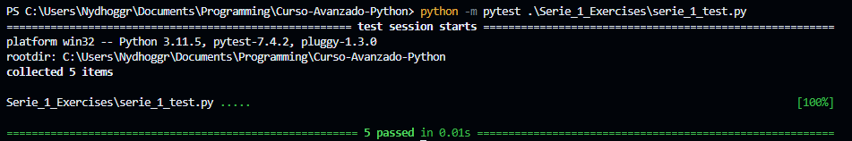
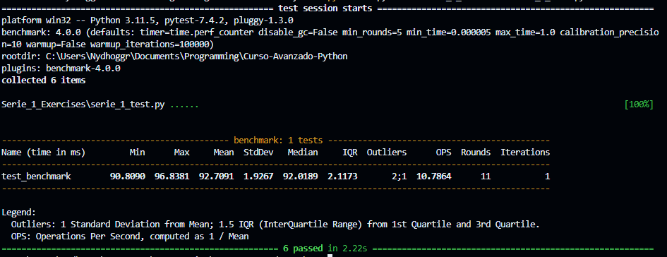
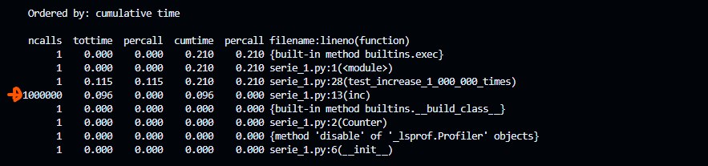
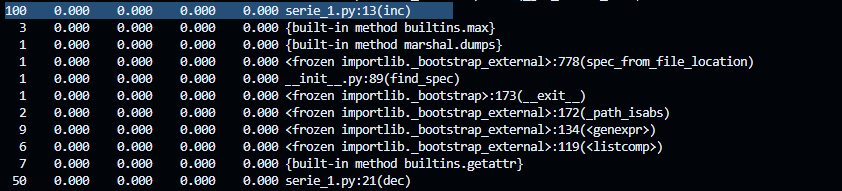
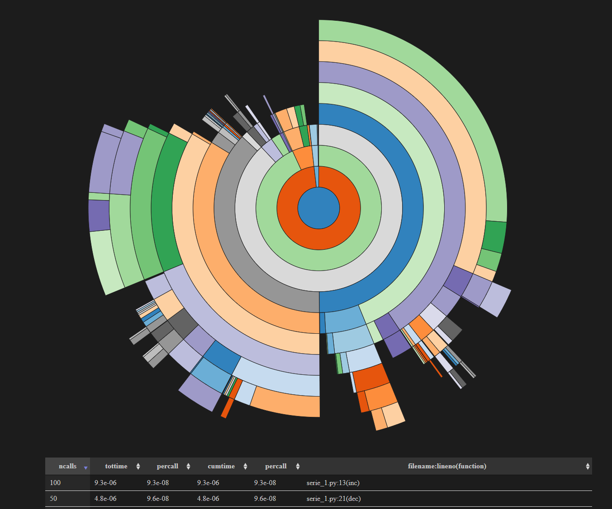

# Python Advanced Programming Course - 1

## Class designing - 01

Design a class `Counter` with the following attributes and methods

* `count` - Current value must be initialized with 0 
* `inc()` - Method that increses in 1 the count variable
* `dec()` - Method that decreases in 1 the count variable

Verify that the following code works:

```py
var_counter = Counter()
var_counter.inc()
var_counter.inc()
var_counter.inc()
var_counter.dec()
print(var_counter.count()) # Output value : 2
assert var_counter.count == 2
```

This exercise has been added as unit test in serie_1_test.py - `test_exercise_1`
## Constructors - 02
Add a constructor to `Counter` class to initialize the value of `count`

```py
def __init__(self, initial_value):
    
    # Variable initial_value taken as class parameter when the object is initialized
    self.count = initial_value
```

Verify that the following code works:

```py 
def test_exercise_2():
    var_counter = Counter(100)
    var_counter.inc()
    var_counter.inc()
    var_counter.inc()
    var_counter.dec()
    print(var_counter.count) # Output value : 2
    assert var_counter.count == 102 
```

This exercise has been added as unit test in serie_1_test.py - `test_exercise_2`

## `__str__` method - 03
Inside the class `Counter` customize the method `__str__` that returns a text with `count` value using the following format:

`return "COUNTER: {}".format(self.count)`

```py
    def __str__(self):
        return "COUNTER: {}".format(self.count)
```

Verify that the following code works:

```py
var_counter = Counter(99)
var_counter.inc()
assert str(var_counter) == "COUNTER: 100"
```

This exercise has been added as unit test in serie_1_test.py - `test_exercise_3`

## Unit testing - 04

Define several methods to test `count` that increases/decreases repetitively using loops/iterators

Following code is the solution, taken from serie_1_test.py
```py
def test_increase_10_times(): # Unit test to increase 10 times the count variable
    # Initialize/Instantiate of Counter class
    var_counter1 = Counter(20)
    
    # For loop that iterates 10 times(0-9)
    for _ in range(10):
        # .inc() method call to increase `count` variable
        var_counter1.inc()
    
    # boolean expression that checks flag statement (true || false) statement -> var_counter1.count == 40
    assert var_counter1.count == 30

def test_decrease_300_times(): # Unit test to decrease 300 times
    # Initialize/Instantiate of Counter class
    var_counter2 = Counter(0)
    
    # For loop that iterates 10 times(0-299)
    for _ in range(300):
        # .dec() method call to decrease `count` variable
        var_counter2.dec()
    
    # boolean expression that checks flag statement (true || false) statement -> var_counter2.count == -600
    assert var_counter2.count == -300

def increase_2_000_000_times(): # Function that increases 2 million times variable `count`
    
    # Initialize/Instantiate of Counter class
    var_counter3 = Counter(0)
    for _ in range(2_000_000):
        var_counter3.inc()
    
    # boolean expression that checks flag statement (true || false) statement -> var_counter3.count == 2_000_000
    assert var_counter3.count == 2_000_000
```
Results `python -m pytest serie_1_test.py`:


## Function performance - 05

Create a unit test that receives `benchmark` that allows you to measure execution time of a function that acts over `count` variable:

Solution taken from serie_1_test.py

```py
def increase_2_000_000_times(): # Function that increases 2 million times variable `count`
    
    # Initialize/Instantiate of Counter class
    var_counter3 = Counter(0)
    for _ in range(2_000_000):
        var_counter3.inc()
    
    # boolean expression that checks flag statement (true || false) statement -> var_counter3.count == 2_000_000
    assert var_counter3.count == 2_000_000

def test_benchmark(benchmark):
    benchmark(increase_2_000_000_times)
```



## Code analysis with `CProfile` - 06

Create a code that increases the `count` 1 million times and analyze the execution with `CProfile`

Solution taken from serie_1.py

```py
def test_increase_1_000_000_times():
    
    # Initialize/Instantiate of Counter class
    var_coiunter4 = Counter(0)
    for _ in range(1_000_000):
        var_coiunter4.inc()
    
    # boolean expression that checks flag statement (true || false) statement -> var_coiunter4.count == 1_000_000
    assert var_coiunter4.count == 1_000_000
```

Results:



## `cProfile` visualization with `snakeviz` - 07

Modify your code to analize calls to other functions or methods:

```py
def increase_to(n):
    while var_counter7.count != n:
        var_counter7.inc()

def decrease_to(n):
    while var_counter7.count != n:
        var_counter7.dec()
```

Exercise as unit test:

```py
def test_exercise_7():
    var_counter7 = Counter(0)
            
    def increase_to(n):
        while var_counter7.count != n:
            var_counter7.inc()

    def decrease_to(n):
        while var_counter7.count != n:
            var_counter7.dec()

    increase_to(100)
    decrease_to(50)
    
    assert var_counter7.count == 50
```

I had to execute just the function `def test_exercise_7()` in `serie_1_test.py`to create the profile output


Determines which lines of code have `100` and `50` calls (`ncalls`).

Result:



Sunburst style - Data vizualization of `ncalls`:



Increase method `ncalls` and execution time:


Decrease method `ncalls` and execution time:


