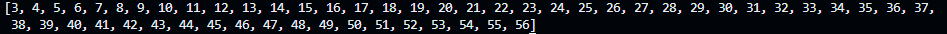

# Advanced programming execises - Serie 2

## Lists

> List mapping - 01

Generate a list with numbers from 1 - 100 and generates the list of squared numbers using generated lists and also using the `map` function.

Code taken from series_2.py:

```py
# Creation of list
list1 = []

# For loop to append 100 elements in the list using the value of the counter as cell value
for i in range(1,101):
    # Appends the element i to list[i] position
    list1.append(i)

# Creating list2 using generated lists where (xi) is the element is the element contained inside list1
list2 = [xi ** 2 for xi in list1]

# Generating list with map function
# map - executes for each item a function 
# lambda - Anonymous function that is executed online, no declaration needed
list3 = list(map(lambda i:i**2,list1))
```

List 1:


List 2 and 3:


> Filter lists - 02

Generate a list with the numbers 3-57 (inclusive) from a range and generates cubed numbers which are multiples of 3 through generated lists and also through the filter function.

Code taken from series_2.py:

```py
# Generating list from number 3-57 (1:1)
list_ex3 = [i for i in range(3,57)]

# List of cubed numbers of list_ex3 which are multiple of 3 - generated lists
list_ex3_cubed = [i ** 3 for i in list_ex3 if i % 3 == 0]

# List of cubed numbers of list_ex3 which are multiple of 3 - using filter function
list_ex3_cubed2 = list(map(lambda a: a ** 3, filter(lambda b:b % 3 == 0, list_ex3)))
```

List 1 - Result:



List 2 - Result:


List 3 - Result:


> List Reduction - 03

Generate a list of numbers 4 to 84 (exclusive) from a range and add all those that are multiples of 4 (for example, 4 + 8 + 12 + 16 + ... + 76 + 80). It uses the strategy by generated lists, the strategy by filters and also the strategy by reduces.

Generated list:

```py
# Sum of all list elements if multiples of 4 = Output: 312 -> Generated lists
sum_generated_list = sum([i for i in e4_list if i % 4 == 0])
```

Filter function: 

```py
# Sum of all list elements if multiples of 4 = Output: 312 -> using Filter function
sum_filter = sum(list( filter(lambda b:b%4==0, e4_list)))
```

Reduce function:
```py
# Sum of all list elements if multiples of 4 = Output: 312 -> using reduce
from functools import reduce

sum_reduce = reduce(lambda a,b: a+b if (b%4==0) else a, e4_list)
print(sum_reduce)
```