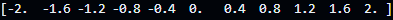

# Advanced programming execises - Serie 2

## Lists

### List mapping - 01

Generate a list with numbers from 1 - 100 and generates the list of squared numbers using generated lists and also using the `map` function.

Code taken from series_2.py:

```py
# Creation of list
list1 = []

# For loop to append 100 elements in the list using the value of the counter as cell value
for i in range(1,101):
    # Appends the element i to list[i] position
    list1.append(i)

# Creating list2 using generated lists where (xi) is the element is the element contained inside list1
list2 = [xi ** 2 for xi in list1]

# Generating list with map function
# map - executes for each item a function 
# lambda - Anonymous function that is executed online, no declaration needed
list3 = list(map(lambda i:i**2,list1))
```

List 1:


List 2 and 3:


### Filter lists - 02

Generate a list with the numbers 3-57 (inclusive) from a range and generates cubed numbers which are multiples of 3 through generated lists and also through the filter function.

Code taken from series_2.py:

```py
# Generating list from number 3-57 (1:1)
list_ex3 = [i for i in range(3,57)]

# List of cubed numbers of list_ex3 which are multiple of 3 - generated lists
list_ex3_cubed = [i ** 3 for i in list_ex3 if i % 3 == 0]

# List of cubed numbers of list_ex3 which are multiple of 3 - using filter function
list_ex3_cubed2 = list(map(lambda a: a ** 3, filter(lambda b:b % 3 == 0, list_ex3)))
```

List 1 - Result:


List 2 - Result:


List 3 - Result:


### List Reduction - 03

Generate a list of numbers 4 to 84 (exclusive) from a range and add all those that are multiples of 4 (for example, 4 + 8 + 12 + 16 + ... + 76 + 80). It uses the strategy by generated lists, the strategy by filters and also the strategy by reduces.

Generated list:

```py
# Sum of all list elements if multiples of 4 = Output: 312 -###  Generated lists
sum_generated_list = sum([i for i in e4_list if i % 4 == 0])
```

Filter function: 

```py
# Sum of all list elements if multiples of 4 = Output: 312 -###  using Filter function
sum_filter = sum(list( filter(lambda b:b%4==0, e4_list)))
```

Reduce function:
```py
# Sum of all list elements if multiples of 4 = Output: 312 -###  using reduce
from functools import reduce

sum_reduce = reduce(lambda a,b: a+b if (b%4==0) else a, e4_list)
print(sum_reduce)
```

Which of the 3 is `more efficient`? Use `timeit` to measure performance.

Generated list code:
```py
time_generated_list = timeit.repeat(
    # Code that we want to measure
    stmt="sum_generated_list = sum([i for i in e4_list if i % 4 == 0])",
    # Setup details that need to be executed before stmt
    setup="e4_list = [i for i in range(4,49)]",
    # Times stmt will be executed as per the number is given
    number=1,
    repeat=5
)
```
Filter function code:
```py
time_filter_function = timeit.repeat(
    # Code that we want to measure
    stmt="sum_filter = sum(list( filter(lambda b:b%4==0, e4_list)))",
    # Setup details that need to be executed before stmt
    setup="e4_list = [i for i in range(4,49)]",
    # Times stmt will be executed as per the number is given
    number=1,
    repeat=5
)
```

Reduce functools code:

```py
time_functools = timeit.repeat(
    # Code that we want to measure
    stmt="sum_reduce = reduce(lambda a,b: a+b if (b%4==0) else a, [i for i in range(4,49)])",
    # Setup details that need to be executed before stmt
    setup= "from functools import reduce",
    # Times stmt will be executed as per the number is given
    number=1,
    repeat=5
)
```

Timeit results:


###  Generation of equidistant arrays - 04

Generate 11 values equally distribted betwwn range -2 , +2 using `numpy.linspace`

Code:

```py
# import of numpy module
import numpy as np
# numpy.linspace(start, stop, num=X)
np_values = np.linspace(-2, 2, num=11)
```

Result of array:



###  `0` Matrix - 05

Generate a matrix of 6*8 filled wit ceros:
* Modify the index in `row 4, column 5` with value 3 
* Modify `row 3, column 4` with value 6
* Get value of `row 3` and get the avg value
* Get `column 5` and avg value of the complete row
* Get the transposed matrix and retrieve `row 4` and get the average of its values ​​
* Retrieve `column 4` and get the average of its values.

Code:

```py
#  Exercise 5
cero_matrix = np.zeros((6,8))

# Modify the index row 4, column 5 with value 3
cero_matrix[3][4] = 3

# Modify index  in row 3, column 4 with value 6
cero_matrix[2][3] = 6

# Matrix output:
# [[0. 0. 0. 0. 0. 0. 0. 0.]
#  [0. 0. 0. 0. 0. 0. 0. 0.]
#  [0. 0. 0. 6. 0. 0. 0. 0.]
#  [0. 0. 0. 0. 3. 0. 0. 0.]
#  [0. 0. 0. 0. 0. 0. 0. 0.]
#  [0. 0. 0. 0. 0. 0. 0. 0.]]

# Get row 3 and calculate the avg of their values
# Range: [0. 0. 0. 6. 0. 0. 0. 0.]
# Avg = 0.75
avg = cero_matrix[2, :].mean()

# Get column 5 and obtain the avg value of the array
# Output = 0.5
avg_2 = cero_matrix[:, 4].mean()

# Get transposed matrix and obtain row 4 - Calculate the avg of the values
# Output : 1.0
t_1 = cero_matrix.T[3, :].mean()

# Get transposed matrix and obtain column 4 - Calculate the avg of the values
# Output = 0.375
t_2 = cero_matrix.T[:, 3].mean()
```

Why do we get these values?
Average is calculated by sum(all elements in array) / number of elements, when we create a transpose matrix we do the following:


That means that we transpose Column -###  Row & Row -###  Column

###  `3-D` Matrix - 06

* Create a vector x in a linealspace -10 - +10 with `11` numbers
```py
# Output = [-10.  -8.  -6.  -4.  -2.   0.   2.   4.   6.   8.  10.]
v_x = np.linspace(-10, 10, num=11)
```
* Create vector y in a lineal space from `-10` - `+10` with 21 numbers
```py
# Output = [-10.  -9.  -8.  -7.  -6.  -5.  -4.  -3.  -2.  -1.   0.   1.   2.   3.   4.   5.   6.   7.   8.   9.  10.]
v_y = np.linspace(-10, 10, num=21)
```
* Create a matrix `z` with `11x21` ceros
```py
# Output:
# [[0. 0. 0. 0. 0. 0. 0. 0. 0. 0. 0. 0. 0. 0. 0. 0. 0. 0. 0. 0. 0.]
#  [0. 0. 0. 0. 0. 0. 0. 0. 0. 0. 0. 0. 0. 0. 0. 0. 0. 0. 0. 0. 0.]
#  [0. 0. 0. 0. 0. 0. 0. 0. 0. 0. 0. 0. 0. 0. 0. 0. 0. 0. 0. 0. 0.]
#  [0. 0. 0. 0. 0. 0. 0. 0. 0. 0. 0. 0. 0. 0. 0. 0. 0. 0. 0. 0. 0.]
#  [0. 0. 0. 0. 0. 0. 0. 0. 0. 0. 0. 0. 0. 0. 0. 0. 0. 0. 0. 0. 0.]
#  [0. 0. 0. 0. 0. 0. 0. 0. 0. 0. 0. 0. 0. 0. 0. 0. 0. 0. 0. 0. 0.]
#  [0. 0. 0. 0. 0. 0. 0. 0. 0. 0. 0. 0. 0. 0. 0. 0. 0. 0. 0. 0. 0.]
#  [0. 0. 0. 0. 0. 0. 0. 0. 0. 0. 0. 0. 0. 0. 0. 0. 0. 0. 0. 0. 0.]
#  [0. 0. 0. 0. 0. 0. 0. 0. 0. 0. 0. 0. 0. 0. 0. 0. 0. 0. 0. 0. 0.]
#  [0. 0. 0. 0. 0. 0. 0. 0. 0. 0. 0. 0. 0. 0. 0. 0. 0. 0. 0. 0. 0.]
#  [0. 0. 0. 0. 0. 0. 0. 0. 0. 0. 0. 0. 0. 0. 0. 0. 0. 0. 0. 0. 0.]]
Z = np.zeros((11,21))
```
* Loops through indices 0 to 11 (exclusive) for an i, inside the iterator loops through indices 0 to 21 (exclusive) for a j. Inside both iterators get the xi of array x at index i (i.e. x[i]), get the yj of the array y at index j (i.e. y[j]).
```py
#Loops through indices 0 to 11 (exclusive) for an i, inside the iterator loops through indices 0 to 21 (exclusive) for a j.
for i in range(len(v_x)):
    for j in range(len(v_y)):
        # Inside both iterators get the xi of array x at index i (i.e. x[i]).
        print(f"Index i: {i} Value:{v_x[i]}")
        # Inside both iterators get the yj of the array y at index j (i.e. y[j]).
        print(f"Index j: {j} Value:{v_y[j]}")
```
* Calculate Z[i][j] = np.exp(-(xi ** 2 + yj ** 2))
```py
for i in range(len(v_x)):
    for j in range(len(v_y)):
        # Inside both iterators get the xi of array x at index i (i.e. x[i]).
        print(f"Index i: {i} Value:{v_x[i]}")
        # Inside both iterators get the yj of the array y at index j (i.e. y[j]).
        print(f"Index j: {j} Value:{v_y[j]}")
        
        # Calculate Z[i][j] = np.exp(-(xi ** 2 + yj ** 2)).
        Z[i][j] = np.exp(-(v_x[i] ** 2 + v_y[j] ** 2))
```
* Calculate the projected matrices of X and Y to graph in 3 dimensions
```py
Y, X = np.meshgrid(v_y, v_x)
```
* Create a graph with X, Y and Z
```py

ax = plt.figure().add_subplot(projection='3d')

ax.plot_surface(X, Y, Z)

```
Result:


* Use `101` and `202` numbers instead 11 and 21
```py
v_x2 = np.linspace(-10, 10, num=101)
v_y2 = np.linspace(-10, 10, num=201)
Z2 = np.zeros((101,201))

#Loops through indices 0 to 11 (exclusive) for an i, inside the iterator loops through indices 0 to 21 (exclusive) for a j.
for i in range(len(v_x2)):
    for j in range(len(v_y2)):
        # Inside both iterators get the xi of array x at index i (i.e. x[i]).
        print(f"Index i: {i} Value:{v_x2[i]}")
        # Inside both iterators get the yj of the array y at index j (i.e. y[j]).
        print(f"Index j: {j} Value:{v_y2[j]}")
        
        # Calculate Z[i][j] = np.exp(-(xi ** 2 + yj ** 2)).
        Z2[i][j] = np.exp(-(v_x2[i] ** 2 + v_y2[j] ** 2))
Y2, X2 = np.meshgrid(v_y2, v_x2)

ax2 = plt.figure().add_subplot(projection='3d')
ax2.plot_surface(X2, Y2, Z2)
```
* How does it look like when you apply the following expression -` Z[i][j] = np.exp(-1e-3 * (x[i] ** 2 + y[j] ** 2))`
Result:

